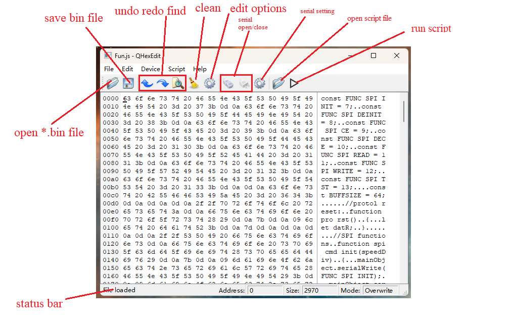

# QtFlashProgrammer

A simple tool whitch can control device with SPI or IIC by serial port to program or burn flash like W25QXX or 24CXX.

# GUI introduction

# features

1. A simple binary editor([qhexedit2](https://github.com/Simsys/qhexedit2)) is inside.

2. It can connect serial device and send any command to program or burn flash like w25qxx.

3. It runs a JavaScript file to control serial device.

# Device supported

my device: [LiHangBing/arduinoFlashPro: program or burn flash like w25qxx by arduino with serial connection. (github.com)](https://github.com/LiHangBing/arduinoFlashPro)

read source code to create your device.

# User guide

1. connect your device like usb to serial port.

2. open the project released.

3. if you want to upload bin file to device, open a binary file.

4. set serial port parameter and open it.

5. edit "Fun.js" if needed (because here not support "import" in JS.)

6. edit your JS script file and open it(see example or test for more)

7. run script.

# API guide

See jstoolclass.h where function with Q_INVOKABLE definition can used in JavaScript.

And see example or test folders to quickly get started.

# Development guide

Open QtFlashProgrammer.pro with QT creater(version 6.x above)

# To do

- [ ] Multithreading(current speed is low because of gui process. And it read w25q128 cost about 20 minutes at maximum baud rate)

- [ ] error and timeout process.

# Reference

[Simsys/qhexedit2: Binary Editor for Qt (github.com)](https://github.com/Simsys/qhexedit2)

[nofeletru/UsbAsp-flash: Program allow you to program flash memory on the protocols spi, I2C, MicroWire. Supports CH341a, UsbAsp, AVRISP(LUFA), Arduino, FT232H. (github.com)](https://github.com/nofeletru/UsbAsp-flash)

[qt/qtserialport: Qt Serial Port support (github.com)](https://github.com/qt/qtserialport)
